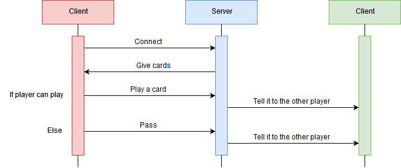

# American Eight
The But of Crazy Eight game is to get rid as soon as possible of all the cards you have in hand.
You can play it on MacOS, Linux and Windows.

## What does it use?
  - .Net Core

## How does it work ?

## How to Play ?
1. You need 2 to 4 clients connected.
2. The dealer distributes 8 cards to each player, one by one.
3. Each player must lay on the gap either:
    * A card of the same color as that found on the top
    * A different color card but of the same rank
    * An eight of any color

## To do
- [X] The valets blow the next player's turn
- [ ] The Ace of Spades change the order of the players

## Can I help you?
Of course ! By hitting the :star: button !
